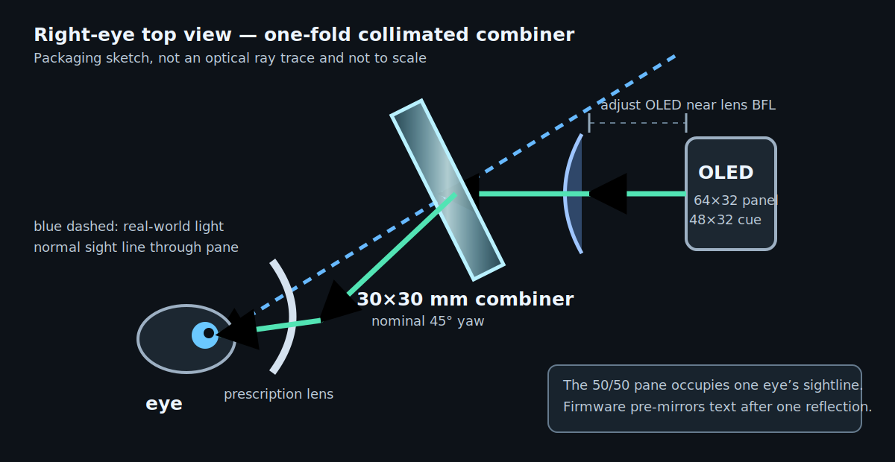

# Optics: what makes the text focusable

The inexpensive, buildable path is a tiny projector and a separate combiner:

```text
OLED → positive lens → 45° partial reflector → prescription lens → eye
```

It does **not** project text onto the prescription lens. The positive lens makes
the OLED rays approximately parallel; after bench calibration, the eye is
intended to perceive a virtual image at a comfortable distance while still
seeing the world through the partially reflective pane. Ordinary prescription
lenses are unreliable reflectors because their angle, curvature, and
anti-reflective coatings vary. Never apply film to them.



## Reference geometry

The CAD defaults are packaging values that must be tuned to the parts in hand:

| Parameter | Reference value |
| --- | ---: |
| OLED controller/module | SSD1315, 64×32, 15.5×13 mm board |
| Emitting raster | approximately 9.92×4.96 mm from 0.155 mm pixel pitch |
| Lens | biconvex acrylic, 25 mm diameter, nominal 45 mm EFL; measure edge/centre thickness and both face sags |
| Lens clear stop | 16×14 mm image-side rectangular tapered aperture; retention stays at the padded outer rim |
| OLED-to-lens travel | 38–52 mm |
| Combiner | 30×30×1.1 mm, 50R/50T plate |
| Lens-to-combiner gap | 15 mm nominal |
| Combiner-to-pupil distance | 32 mm nominal |
| Combiner pose | fixed nominal 45° yaw; calibrate the whole mount |
| Normal position | chief ray centred on the chosen pupil; pane occupies that eye's sightline |

The panel is 64×32, but the reference firmware deliberately lights only the
central 48×32 raster: roughly 7.44×4.96 mm. With the budget lens's 45 mm
thin-lens focal length, its first-order field is:

```text
horizontal FOV = 2 atan(7.44 / (2 × 45)) ≈ 9.5°
vertical FOV   = 2 atan(4.96 / (2 × 45)) ≈ 6.3°
```

The 45° pane makes the beam footprint asymmetric. Sampling every corner of the
16×14 mm stop and every horizontal/vertical field corner against the modeled
pane gives a first-order footprint of about 26.31×16.76 mm. Its horizontal
centre is shifted -1.09 mm from the chief-ray intersection. The CAD shifts the
frame to centre that bundle in its 28×28 mm clear aperture, leaving about
0.84 mm at each horizontal edge and 5.62 mm at each vertical edge. This is a
first-order packaging check, not proof: the cheap singlet will still have edge
blur, distortion, stop-thickness effects, and tight alignment tolerances.

## Eye box and the intentional crop

For a first-order full-field check, intersect all translations of the
rectangular stop made by the four field corners. The calculation deliberately
uses a conservative 47 mm path (15 mm nominal lens-to-pane plus 32 mm
pane-to-pupil); the physical image-side stop sits slightly closer to the pane.

```text
eye-box axis ≈ stop extent − 2 × (stop-to-pupil path) × tan(half field)
horizontal   ≈ 16 − 2 × 47 × (7.44 / 90) ≈ 8.23 mm
vertical     ≈ 14 − 2 × 47 × (4.96 / 90) ≈ 8.82 mm
```

That calculation includes the ideal rectangular field corners, but still
ignores eye rotation, lens aberration, assembly error, stop-edge print error,
and prescription-lens effects. The quoted width and height are modeled extents,
not a guarantee that every point in that rectangle is a comfortable usable eye
box. The build guide therefore sets a lower **measured** acceptance threshold
of 6×6 mm for the whole cropped cue. If it misses, do not call the wearable
complete: re-align on the bench or use a larger matched lens and combiner.
Restoring all 64 columns with this 30 mm pane shrinks the margin too far for the
reference design.

The CAD retains a 23 mm / 30 mm short-focus preset for experiments only. With
its 10 mm stop, it has no positive first-order horizontal overlap for the whole
48-column cue at the reference eye relief. It is not a release build or BOM
alternative.

## Deployed and parked poses

The flip-up hinge changes the storage and clear-away state, not the optical
design. Deployed, the cue still uses the pupil-centred 45-degree path described
above. Parked, it is out of the normal sightline and is not an alternate viewing
angle. The hinge does not make this an off-axis display or make reading while
walking safe. The reference use remains seated and stationary; any gait trial
is limited to the staged [controlled experiment](WALKING_EXPERIMENT.md) after
all prerequisite checks pass.

## Focus is a calibration, not a fixed dimension

Effective focal length is measured from a lens principal plane, not necessarily
from its outer surface. Back focal length (BFL), edge thickness, independently
measured front/rear crown sag, and low-cost part tolerances all matter. A
biconvex label does not prove equal faces. The CAD therefore takes both sags as
explicit inputs and treats its focus-start datum as provisional; that is why the
budget OLED cartridge moves 14 mm.

1. Measure the lens, including each face sag from its own rim plane, and the
   OLED; then update the top-level CAD parameters. The entered front face is the
   image-side/stop-facing surface.
2. Build the focus jig before the wearable mount.
3. Start with the OLED emitting plane at the supplier's BFL. If only EFL is
   known, start slightly inside that distance and use the full adjustment range.
4. Place a camera at the intended eye point, set manual focus to infinity, and
   aim through the combiner at a distant scene.
5. Move the OLED until both the cue and distant scene are acceptably sharp
   without refocusing the camera. Lock the sled.
6. Only then do a brief seated human alignment test with all glass edges covered.

For a plano-convex lens, start with the plano face toward the OLED and curved
face toward the collimated side. A genuinely symmetric biconvex lens has no
preferred face. If the cheap biconvex part is asymmetric and either orientation
focuses acceptably, the shallower crown toward the image-side stop provides
more mechanical clearance; always enter the two sags in their installed order.

## Combiner choices

- **Reference:** 30×30 mm, roughly 50% reflection / 50% transmission plate
  specified near 45°. It prioritizes cue brightness for indoor use.
- **Higher see-through:** 30R/70T teleprompter material. The world is brighter,
  but the cue is dimmer.
- **Cheapest experiment:** 0.5–1 mm clear PET/polycarbonate plus HUD reflective
  film. It is safer and easy to cut, but often creates a double image.
- **Plain clear sheet:** only a few percent reflection and usually useful only
  in a dim room.

Put a coated splitter face toward the incoming OLED beam to suppress the second
surface ghost. Do not FDM-print the optical pane. Use the cut template only for
plastic/film experiments. Never cut, drill, grind, or round the sourced coated
glass; keep its vendor-finished shape. Fit the one-piece recessed soft radial
edge collar before lowering the pane into the rigid frame, then add the separate
soft face gasket. Fully capture all four edges/corners and handle coated faces
only by their edges.

An optional opaque flag behind the pane can improve contrast in a moderately
bright indoor room and allow lower OLED power. It does not make the display
sunlight-readable or suitable for outdoor use. The flag makes the display
temporarily occluded, which is acceptable for a stationary autocue but not an
AR illusion.

## Prescription and polarization checks

Test through the exact glasses. Strong curvature, progressive zones, prism,
tints, and coatings can change focus or alignment. OLED light is polarized;
polarized sunglasses may make it dim or disappear at one orientation. Rotate the
loose OLED module 90° during the bench test. The fixed reference cartridge does
not fit the rotated rectangular board; if that orientation wins, swap the
measured PCB/window axes in the CAD and print a matching cartridge.

## Primary references

- [Waveshare 0.49-inch OLED dimensions and pixel pitch](https://www.waveshare.com/0.49inch-oled-module.htm)
- [Edmund Optics focal length and field-of-view relationship](https://www.edmundoptics.com/knowledge-center/application-notes/imaging/understanding-focal-length-and-field-of-view/)
- [Edmund Optics lens geometry and PCX orientation](https://www.edmundoptics.com/knowledge-center/application-notes/optics/understanding-optical-lens-geometries/)
- [Thorlabs plate beamsplitter construction and rear-surface reflection](https://www.thorlabs.com/NewGroupPage9_PF.cfm?ObjectGroup_ID=4808)
