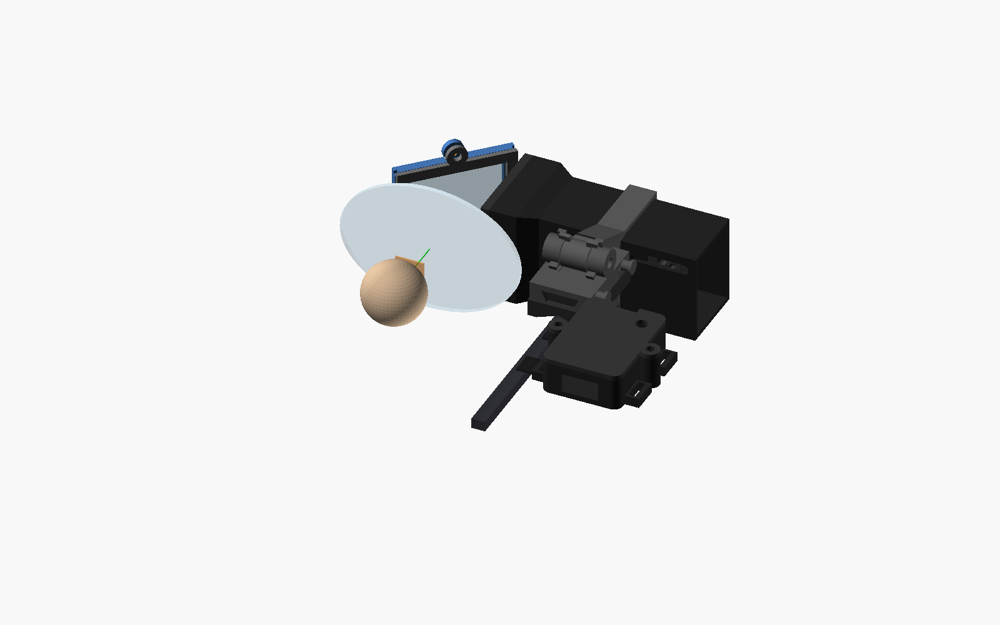
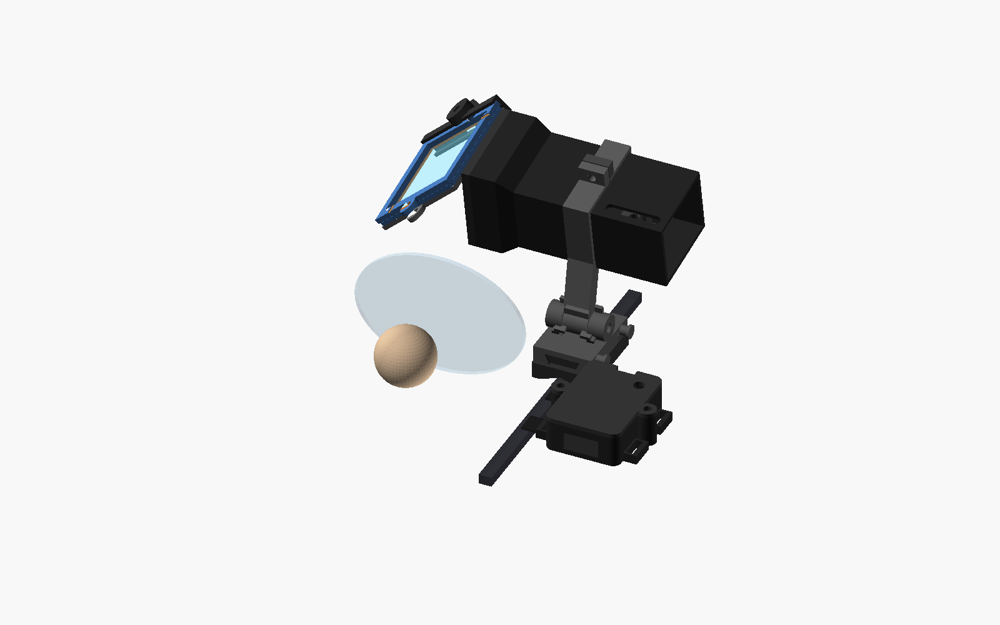
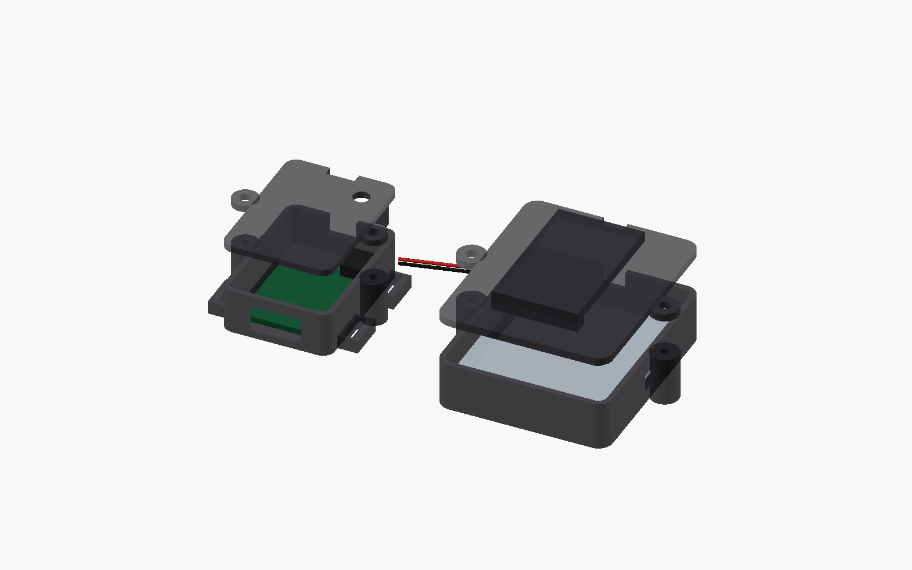

# OpenGlassHole CAD

This directory contains the parametric OpenSCAD 2021.01 source, reviewed STL
exports, and mechanical validation tools for the v0.2 monocular autocue. It is
a buildable optical/mechanical experiment, not certified eyewear. Prove the
optics on the bench before putting any part near an eye.





These are generated directly from `openglasshole.scad` with
`./render_previews.sh`. They include scale proxies for the eye, prescription
lens, and temple; they are not photographs or human-fit evidence.

## Presets and optical limits

`lens_preset="budget_25x45"` is the source and release-STL default:

- sourced 25 mm diameter, +45 mm focal-length biconvex acrylic lens;
- published 1.2 mm **edge** thickness, provisional 5 mm centre thickness and
  provisional, separately entered 1.90 mm crown sag on each face;
- explicit provisional packaging/focus-start datum 0.6 mm behind the front rim
  plane; this is not inferred from lens symmetry or claimed as a principal plane;
- 38–52 mm OLED focus travel, previewed at 45 mm;
- central 48×32 pixels of the 64×32 OLED (7.44×4.96 mm active viewport);
- 16×14 mm rectangular physical aperture stop matched to the cropped field;
- 30×30×1.1 mm 50R/50T plate at 45 degrees, with 28 mm frame opening;
- 15 mm nominal lens-to-combiner axial gap and 32 mm bench eye datum.

`compact_23x30` remains available in source for experiments, but it is not a
recommended or release preset. At the same 32 mm eye datum its 10 mm stop and
wider field cannot provide a useful common full-viewport eye box. Do not buy the
more expensive compact lens on the assumption that it is a drop-in upgrade.

The SCAD computes the first-order extrema where the aperture/field rays meet an
oblique 45-degree pane. It also shifts the physical pane along its own axis to
centre that asymmetric footprint. For the budget preset, sampling all stop and
field corners gives a first-order footprint of 26.31 mm horizontally by
16.76 mm vertically. The signed frame shift is -1.09 mm, leaving 0.84 mm at
each horizontal edge and 5.62 mm at each vertical edge of the 28×28 mm clear
opening. These are packaging calculations, not measured optical guarantees:
the physical stop is on the OLED side of a thick, cheap singlet, and real
principal planes, aberrations, decentre, print error, and surface tolerances
matter. The focus bench and measured eye-box map are authoritative.

The modeled ray plane is the combiner's incoming/coated glass face, not the
printable base. The frame base is shifted 2.7 mm behind that face along the
pane normal, and each bracket/bench socket is centred on the complete 4.25 mm
base–glass–gap–clamp stack. This datum distinction prevents the plastic stack
from silently moving the reflected ray.

For the nominal sharp-corner 16×14 mm CAD stop, intersecting every translated
stop at the conservative 15+32 mm propagation distance gives first-order
common-eye-box axis spans of 8.23 mm horizontally by 8.82 mm vertically. Those
are ideal computed spans, not a guaranteed rectangular measured eye box. The
stop corners reach a 10.63 mm lens radius and expose 26.8% more lens area than
the former 15 mm circular stop, so print-rounded corners and cheap-singlet
outer-zone aberration can reduce the usable result. Map the complete cue and
all four cue corners on a two-dimensional camera grid. Reject or redesign a
build if that **measured** whole-cue eye box is smaller than 6×6 mm or is not
comfortable; do not compensate by placing glass closer to the eye.

## Compact walking-experiment packaging

The current release-default optical prescription is retained while four
packaging changes reduce modeled head-worn printed volume and CAD bulk:

- the nominal 58.8 mm CAD tunnel retains its 27.9 mm square lens shoulder but
  tapers to a 21.3×25.9 mm main body instead of carrying the square cell full
  length;
- the keyed 18.4×23 mm OLED sled has 1.11 cm³ modeled volume, down from the
  former 2.15 cm³ CAD geometry;
- `compact_carriage` combines the rail lock and clear-away pivot, replacing
  `quick_release` plus `mount_adapter` in a new build. Its base is
  18×24×5 mm; knuckles and keeper pegs make the complete rendered envelope
  21.1×24×12.7 mm;
- `controller_pod` keeps the XIAO/button/antenna beside the short OLED cable,
  while `body_battery_pod` carries the unchanged protected 500 mAh cell and
  switch off the glasses. A walking experiment additionally requires a
  builder-selected and builder-tested low-retention disconnect in its two-wire
  power tether.

The deployed head-mounted CAD envelope without wearer proxies is about
100.0×88.5×46.4 mm including the controller pod and strap bridges; the forward
optics/mount alone are about 89.2×57.8×46.4 mm. Parked, the head-mounted envelope
is about 100.0×80.6×61.5 mm because the optics move above the sightline. These
axis-aligned envelopes are packaging checks, not clearance or comfort proof.

The CAD rotates the engine 100° around the M2.5 carriage pin between paired
radial contact stops at 0° and 100°. Each limit has two 1.3 mm radial by
1.3 mm axial contact patches, one beside each end of the moving barrel. The
source asserts the contact planes and clearances, and `validate.sh` checks that
the carriage/clamp intersection is empty at 17 interior sweep angles but solid
1° beyond either limit. This is geometry validation, not proof that printed
tabs survive wear or impact. A short replaceable silicone/TPU loop passes
through the moving bridge and is manually moved between the front and rear
keeper pegs; pose retention must not rely on pivot friction. Bench-cycle the
hinge and keeper and measure both physical poses, including proof that the pane
clears normal/lower-forward view on the actual wearer, before a
[controlled walking experiment](../../docs/WALKING_EXPERIMENT.md).

## Safe lens cell

The biconvex lens is not trapped between flat hard rings. The tunnel has:

- full-diameter relief around both curved lens surfaces;
- three rear printed lands near the physical outer rim;
- three matching front lands on `lens_retainer` or `combiner_bracket`;
- a 16×14 mm rectangular tapered stop on the exterior/image-side front plate;
- a final 1.0 mm full-pocket counterbore before the compliant lands.

The SCAD takes `LENS_FRONT_SAG` and `LENS_REAR_SAG` as independent measured
inputs and derives a separate spherical envelope from each. The symmetric
1.90 mm defaults are provisional packaging data only. An asymmetric biconvex
lens may put most of its crown on either face. The stop-facing/image-side
**front** sag alone drives the angle-sampled, analytic-radial hard-gap check
across the complete rectangular-to-round taper; the rear sag alone drives the
tunnel relief depth. The minimum need not occur at the aperture boundary. With
the provisional defaults, the budget model's conservative checked lower bound
is about 0.94 mm after its 0.02 mm mesh allowance. It exceeds the asserted
0.6 mm minimum, but is not a guarantee for a purchased lens.

Before printing the final cell, measure the real lens in this order:

1. Measure diameter, centre thickness, and outer-rim edge thickness without
   squeezing the acrylic.
2. Support one rim plane on a depth-gauge fixture, measure its crown height,
   flip the lens, and independently measure the other crown height.
3. Confirm `edge + front sag + rear sag` agrees with centre thickness within
   the named 0.20 mm measurement allowance. Mark the face chosen to point at
   the retainer/combiner as **front/image-side** on removable rim tape.
4. Enter both measured sags and thicknesses, regenerate, and inspect the
   physical cell for at least 0.6 mm hard-surface clearance. The derived
   spherical surfaces are still approximations; the focus bench and a physical
   no-contact inspection are authoritative.

Put a matched nominal 0.7–0.8 mm closed-cell silicone, TPU, or optical-foam dot
on each of the six lands. Each opposing pair must exceed 1.2 mm uncompressed
(normally 1.4–1.6 mm total) and compress lightly into that modeled allowance;
reject a pair that rattles or requires plate bowing. Trim every dot so it
contacts only the outermost lens rim. Tighten the two front screws evenly only
until the dots prevent rattle. Printed plastic must never touch or preload
either convex clear surface.

## Combiner retention

Use the purchased square 30×30×1.1 mm glass plate as supplied. Do **not** score,
grind, chamfer, drill, or round the coated glass. The rounded/chamfered
`cut_template` is only for machinable plastic/film experiments or a professional
vendor-cut alternative. Mark coating orientation on removable frame tape, not
by modifying the pane.

The base's four overlapping full-length rails define a 32.0 mm rigid cavity;
they must never touch bare glass. Fit `combiner_edge_liner` around all four
edges and corners first. It is a one-piece **soft TPU or silicone** radial
collar with 29.8 mm free opening, 31.4 mm free outer size, 0.8 mm nominal wall,
and corner reliefs. Its 0.10 mm-per-side stretch gives a conservative 31.6 mm
fitted envelope, leaving 0.20 mm per side to the rails. Its 0.90 mm height is
recessed 0.10 mm from each glass face so it cannot become an axial clamp land.

Dry-fit the collar on the unmodified pane, covering every edge and corner.
Verify that it sits below both coated faces, then lower the pane and collar into
the frame together. Confirm soft material separates every glass edge from every
rigid rail; never force, abrade, score, or glue the pane. Only then add
`combiner_shim`, the separate 0.30 mm **soft TPU or foam face gasket**, inside
the rails. It compresses into the nominal 0.15 mm axial stack gap. Neither soft
part may be printed in rigid PETG/PLA.

The clamp uses two M2 through-bolts. Their head, nut, and washer envelope must
be no larger than 5.0 mm OD. After the modeled ±0.25 mm pane/liner motion and
±0.25 mm screw motion, the derived geometry preserves 1.05 mm to glass and
0.25 mm to the fitted liner. Put both heads on the clamp/outboard face and the
washer/nut on the base/bracket side. The wearable bracket positively captures
the complete lower ear with a rear boss; its shallow socket is alignment, not
safety retention. Tighten only until the face gasket prevents rattle; stop if
the frame bows or glass sees point pressure.

## Selectors

Set `part` in `openglasshole.scad` or pass `-D 'part="..."'`.

| Selector | Output | Purpose |
| --- | --- | --- |
| `assembly` | preview | Deployed/parked right/left wearable, compact hinge, selected pod, and chief ray. |
| `bench_assembly` | preview | Focus bench with the shifted combiner and nominal optics. |
| `split_pods_preview` | preview | Exploded local-controller and body-battery packaging with component proxies. |
| `focus_bench_jig` | printable | Canonical focus jig filename/selector. |
| `focus_bench` | printable | Backward-compatible alias for `focus_bench_jig`. |
| `oled_cartridge` | printable | Guided OLED bezel, cable relief, and focus-bolt hole. |
| `lens_tunnel` | printable | Support-free light tunnel, compliant rear lands, and focus slots. |
| `lens_retainer` | printable | Bench retainer with tapered surface relief and front pad lands. |
| `combiner_frame` | printable | Four-edge pane base with two M2 clearance ears. |
| `combiner_clamp` | printable | Matching two-screw clamp ring. |
| `combiner_shim` | soft printable/template | Compressible perimeter gasket; never rigid filament. |
| `combiner_edge_liner` | soft printable/template | Recessed, four-edge radial glass guard with corner reliefs. |
| `temple_saddle` | printable | Padded V saddle, two hook-and-loop strap stations, and rail. |
| `compact_carriage` | printable | Release-default rail lock, fixed 0°/100° stop spines, hinge knuckles, and keeper pegs. |
| `quick_release` | legacy printable | Original sliding carriage; use only with `mount_adapter`. |
| `mount_adapter` | legacy printable | Original cross adapter; replaced by `compact_carriage`. |
| `engine_cradle` | printable | Lower split collar with clamp pilots. |
| `engine_clamp` | printable | Upper split collar plus moving two-limit stop wings, hinge barrel, and keeper-loop bridge. |
| `combiner_bracket` | printable | Lens-safe front plate, shifted pane socket, and bolted capture boss. |
| `rear_pod` | legacy printable | Integrated protected-cell/XIAO pod for stationary builds. |
| `rear_pod_lid` | legacy printable | Integrated-pod lid with BTN1 reaction cage and FPC-antenna guides. |
| `rear_button_retainer` | printable | Slide-in wired-button backstop with open U-slot and pull tab. |
| `controller_pod` | printable | Small local XIAO/button pod with two temple straps and short OLED exit. |
| `controller_pod_lid` | printable | Local pod lid with BTN1 cage and FPC-antenna guides. |
| `body_battery_pod` | printable | Remote protected-cell/SW1 housing and power-tether exit. |
| `body_battery_pod_lid` | printable | Screwed body-pod lid with raised collar/pocket clip. |
| `fit_coupon` | printable | Lens diameter, three pane slots, and rail fits. |
| `cut_template` | 2D DXF/SVG | Plastic/film/vendor-cut alternative only. |
| `cut_template_print` | printable | Physical plastic/film template; not a glass-working guide. |
| `hinge_interference_probe` | developer check | Carriage/clamp intersection at `hinge_probe_angle`; intentionally empty inside the travel range. |

For the assembly preview, `side` accepts `"right"` or `"left"`; `wear_pose`
accepts `"deployed"` or `"parked"`; and `show_controller_pod`,
`show_rear_pod`, and `show_wearer_proxy` control packaging/proxy visibility.
Manufacturing parts are not handed.

## Export and validation

Reviewed budget-preset meshes are tracked in [`stl/`](stl/). Local exports go
to ignored `build/` and are never silently overwritten:

```bash
cd hardware/cad
./export.sh fit_coupon stl
./export.sh lens_tunnel stl compact_23x30
./export.sh cut_template dxf
FORCE=1 ./export.sh fit_coupon stl
```

`OPENSCAD_BIN=/path/to/openscad` selects a custom executable; otherwise the
scripts try native OpenSCAD and then the Flatpak. The release-parity check is:

```bash
OPENSCAD_BIN=/path/to/openscad make validate
```

This renders every selector under both presets using OpenSCAD 2021 syntax,
rejects warnings/errors/empty output, then checks every STL for one connected
component, exactly two triangles per edge, and nonzero enclosed volume using the
dependency-free `validate_mesh.py`. It also proves that a rear-heavy asymmetric
lens still renders while the same large sag on the stop-facing front trips the
hard-gap assertion. To regenerate the tracked default meshes:

```bash
OPENSCAD_BIN=/path/to/openscad make release-stls
```

To prove tracked meshes have exactly the regenerated triangles (independent of
OpenSCAD facet ordering and winding) without changing them:

```bash
OPENSCAD_BIN=/path/to/openscad make check-release
```

The three tracked PNGs are deterministic source-CAD views, not hand-edited
concept art. Regenerate them, or render them to a temporary directory as a
nonempty-output check, with:

```bash
OPENSCAD_BIN=/path/to/openscad make render-previews
OPENSCAD_BIN=/path/to/openscad make check-previews
```

## Printing and staged fasteners

Start with the fit coupon and focus bench. Suggested first settings are a
0.4 mm nozzle, 0.2 mm layers, three walls, and matte black PETG. Print the soft
combiner face gasket and edge liner separately in TPU, or cut/cast them from
suitable soft foam/silicone. Keep all optical interiors matte.

Orient the tunnel on its square lens end; OLED cartridge on its bezel; each pod
on its closed floor; and bench on its flat base. Put the `lens_retainer`'s
**narrow 16×14 mm stop face down**, so its aperture widens upward and its small
front-pad cantilevers remain self-supporting. Put the combiner rings on a flat
face.

The `compact_carriage` has horizontal barrels and keeper pegs if its broad base
is on the bed, so that orientation requires localized support. For a cleaner
pivot bore, start instead with the hinge axis vertical on one knuckle/body end
and use a brim. Start `engine_cradle` on its lower outer collar face. Start
`engine_clamp` on one collar X-end with the hinge axis vertical; its moving
barrel is recessed 0.2 mm from that bed plane and still needs localized support.
These are slicer starting points, not validated printer profiles. Inspect both
hinge halves and reject split knuckles, a rough pivot bore or bridge hole,
distorted stop surfaces, or keeper pegs with poor layer bonding.

Print `rear_button_retainer` flat on either broad face; the same part retains
BTN1 in the integrated or controller lid. Deburr its U-slot and pull-tab edges
without thinning the two side bearings. Put `controller_pod_lid` and the legacy
`rear_pod_lid` on their exterior broad faces so the underside button cages and
antenna guides build upward; inspect every cage ledge before installing BTN1.
The raised body-pod clip makes its lid support- and orientation-sensitive. Keep
the clip's 30 mm length within the layer plane, use a brim and removable support
where the slicer shows its roughly 27 mm raised span unsupported, then bend-cycle
it off-body and reject whitening, cracks, or root delamination. CAD mesh
validation does not prove clip strength.

`combiner_bracket` is a different one-piece shape: its socket/arm extends about
28 mm past the narrow stop plane, so that plane **cannot** sit on the bed. Put
the square tunnel-interface/full-pocket face (source `x=0`) on the bed with the
socket rising. Use removable, localized support from the build plate inside the
narrowing lens aperture and beneath the socket arm/capture boss. Keep support
off the three compliant-pad lands where possible. After removal, deburr without
enlarging the stop, confirm the 16×14 mm aperture and pad lands, and re-check at
least 0.6 mm hard clearance to the measured lens surface. If support cannot be
removed without scars or distortion in the cell, reject the print and split or
redesign the bracket; this part is not claimed to be support-free.

The modeled fastening order avoids inaccessible nuts:

| Qty | Fastener | Use |
| ---: | --- | --- |
| 4 | M2×6 socket head | split collar (2), lens plate (2) |
| 4 | M2×8 socket head | controller and body-battery pod lids |
| 1 | M2×10 socket head | upper combiner ear |
| 1 | M2×12 socket head | bracket-captured lower combiner ear |
| 2 each | M2 washer ≤5.0 mm OD and M2 nyloc nut | both combiner ears |
| 1 | M2.5×6 socket head | carriage rail position lock |
| 1 | M2.5×22–25 bolt, two washers, one nyloc | clear-away hinge pivot |
| 1 | M2.5×35 bolt, two 8 mm OD washers, one M2.5 nyloc nut | focus lock |

1. Slide `compact_carriage` onto the saddle rail and lock it from the exposed
   side with an M2.5×6 set screw; the carriage is a position lock, **not** a
   breakaway.
2. Put the engine clamp's centre barrel between the carriage knuckles. Insert
   the M2.5×22–25 pivot with a washer at both ends and a nyloc. Tighten only
   enough to remove axial play. Tie the silicone/TPU keeper through the moving
   bridge hole and prove it can be moved positively between both marked pegs.
3. Fit the split collar around the tunnel using two M2×6 screws through the
   upper clearance flanges into the lower printed pilots.
4. Use an M2.5×35 bolt, broad washers, and nyloc nut for the focus cartridge.
5. Use two short M2×6 screws for the lens-safe retainer/bracket, tightening the
   compliant dots evenly.
6. With heads on the clamp/outboard face, use one M2×12 bolt through the
   7.25 mm bracket-captured lower-ear stack and one M2×10 bolt through the
   4.25 mm upper-ear stack. Put a ≤5.0 mm OD, nominal 0.30 mm washer and an
   ordinary nominal 2.80 mm-high M2 nyloc on each base/bracket side. The source
   reserves another 0.80 mm for two full thread pitches beyond each locknut.
   Verify the actual stack and the worst-case glass/liner gaps before inserting
   the pane.
7. Use two M2×8 screws in each pod lid's external bosses. Keep every screw and
   clip root outside the padded pouch-cell envelope.

`quick_release` and `mount_adapter` remain as legacy STLs for existing prints;
their two M2×5 plus two extra M2×6 attachment screws are not used by the compact
reference and they do not provide a clear-away pose.

Printed pilots are consumable. If repeated service loosens them, reprint or use
a deliberately resized heat-set insert design; do not improvise longer screws
where a battery or optical surface lies behind them.

## Bench and wearable reality

The deployed v0.2 optical path still uses a pupil-centred, same-height chief ray
and vertical 45-degree pane. It does not fake an unsupported raised reflection.
The 50/50 pane therefore occupies and dims the monocular sightline while
reading. The whole engine can park 100° above the normal sightline, but the
optical bracket has no yaw/elevation gimbal and the parked pose does not make
deployed walking inherently safe. Fore/aft travel comes from the rail; coarse
placement comes from repositioning the padded saddle straps. If on-frame
alignment needs angular correction, measure it and redesign/print a keyed wedge
or gimbal before use.

The preview models a 2.5 mm minimum static prescription-lens clearance and a rearward
top offset so the temple saddle remains near pupil height. Verify at least
3 mm under deliberate glasses-frame flex before any gait test. Two separate
padded hook-and-loop bands are the intended snag release; the screwed carriage
and glass-frame bolt are not breakaways. A body tether additionally requires a
tested low-retention disconnect within 50 mm of the glasses.



The compact reference uses `controller_pod` on the temple and
`body_battery_pod` on a collar or secured upper pocket. The local shell body is
22.9×31.4×9.4 mm (32.3 mm wide across universal strap/lid ears) and about
10.8 mm tall with its lid installed. It holds the XIAO, button, and FPC antenna;
it does not hold the cell. The body shell is 35.9×42.9×10.2 mm (46.3 mm across
lid ears) and about 16 mm total with its raised clip/lid. It holds only the
protected 31×38×5.3 mm cell, removable padding, SW1, and strain-relieved power
tether. Verify the clip on the actual garment; it is not a breakaway.

The legacy integrated rear pod is intentionally side-mounted: its inner body face is
tangent to the saddle's outboard face, while the nearest strap slot sits farther
outboard and each band bridges back to the temple. It is not centred on top of
the glasses arm. The preview derives its 100 mm temple proxy from both rear-pod
strap stations and asserts that each complete 6.5 mm band footprint lands on
the proxy. On real glasses, confirm both independent bands fully wrap the
temple and release under a snag before adding electronics.

The fixed OLED cartridge fits only the documented PCB orientation. If a loose
90-degree polarization test is better, swap the measured PCB/window Y/Z values
and reprint; the rectangular board cannot simply be forced into this cartridge.

The legacy pod cavity models the protected 31×38×5.3 mm cell and a maximum
17.8×21×4.2 mm assembled XIAO/controller-and-connector envelope with a 3 mm end
gap. Battery guides leave 0.6 mm per side for removable soft padding. The lid
locates a provisional 18×8 mm supplied FPC antenna against plastic and keeps
the 6 mm BTN1 cage at least 5 mm from it. The cage bottom preserves a modeled
0.5 mm above that controller envelope; measure the tallest real board,
connector, solder, and wire feature and enlarge the pod if it exceeds 4.2 mm.

BTN1 must have an actuator at least 2.5 mm above its case so it projects at
least 0.9 mm above the 1.6 mm legacy lid (1.1 mm above the 1.4 mm controller
lid); a common short-stem switch is not operable here. Install the wired switch from the lid underside, stem first, with its body
top against the lid and leads routed toward the cage's open `+Y` side. Slide
`rear_button_retainer` under the body from that side until its rear land stops;
the open U-slot lets the leads remain attached. The 0.8 mm plate bears on two
integral 0.85 mm ledges, providing the axial press reaction. Kapton may cross
the forked pull tab only as an anti-withdrawal/anti-rattle aid; it must not carry
button force, and glue is not a structural backstop. Remove that tape and pull
the plate out for switch service.

A local lip notch clears the nominal button body. Measure its body, stem, pin
exits, and lead bend before printing. Use the antenna adhesive plus Kapton, do
not cover its radiator with metal, and remove the lid for XIAO boot/reset
access. The USB-C, body-pod slide-switch, OLED/power-cable, and button openings
still require measurement against purchased parts.

Key release-mesh envelopes are 58.8×27.9×27.9 mm for `lens_tunnel` (with its
21.3×25.9 mm main body), 34.2×44.1×4.25 mm for the assembled printed combiner
base/clamp stack before hardware, and 101.8×75×37.5 mm for the focus jig. At the
nominal right-eye placement, the deployed forward printed assembly is about
89.2×57.8×46.4 mm; adding the local controller pod/straps gives about
100.0×88.5×46.4 mm. The parked split-pod assembly is about
100.0×80.6×61.5 mm. The legacy integrated rear pod remains available for
stationary builds but is no longer the low-mass preview default.

## Mass and placement

For the budget preset, modeled split-pod head-worn printed volume, including
both soft combiner parts and the button retainer, is 21.06 cm³:

| Group | Volume | Solid PETG equivalent (1.27 g/cm³) |
| --- | ---: | ---: |
| Forward optics + saddle/compact mount | 17.42 cm³ | 22.1 g |
| Local controller pod + lid + button retainer | 3.64 cm³ | 4.6 g |
| Total head-worn printed geometry | 21.06 cm³ | 26.7 g |
| Off-body battery pod + clipped lid | 8.15 cm³ | 10.3 g |

A three-wall/25%-infill slice is still dominated by thin shells; record the
slicer's actual estimate instead of multiplying the solid equivalent by 25%.
With glass, lens, local board/OLED, wire, straps, and fasteners, the compact
glasses-mounted target is more realistically around 35–45 g. That is a derived
target, not a measured result. Relative to the legacy integrated estimate, the
CAD removes 11.52 cm³ (about 14.6 g solid-PETG equivalent) from the glasses and
moves the 11 g reference cell off-body: roughly 25 g less temple load without
changing display, Wi-Fi, focus travel, viewport, or nominal runtime. The remote
pod itself is roughly 21–23 g with the 11 g cell and wiring; keep it on clothing,
not dangling from the glasses. The focus jig and fit coupon add 50.95 cm³
(64.7 g solid-PETG equivalent) but are calibration tools, not worn mass.

Never wear while charging. Never drive, cycle, walk in traffic, or perform a
safety-critical task with the pane in view. Keep the assembly away from direct
sunlight: a positive lens can concentrate solar energy onto the OLED or nearby
material.
